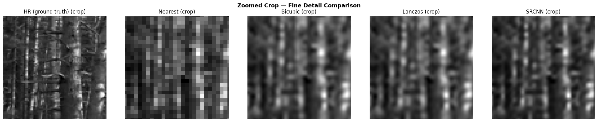

# Video Super Resolution

[](https://colab.research.google.com/github/preeti-chauhan/video-super-resolution/blob/main/video_super_resolution.ipynb)
[](https://github.com/preeti-chauhan/video-super-resolution/blob/main/video_super_resolution.ipynb)

Classical upsampling vs. SRCNN deep learning for frame-by-frame video super resolution.

## Motivation

Video footage is often captured or stored at low resolution, and naive upsampling (bicubic, Lanczos) produces blurry, detail-lacking results. SRCNN learns a patch-level mapping from low- to high-resolution via a lightweight 3-layer CNN, recovering fine detail that classical interpolation cannot reconstruct.

## Overview

Builds a complete video super resolution pipeline covering:
- **Data pipeline** — LR/HR pair generation, patch extraction, train/val/test splits
- **Classical baselines** — nearest neighbour, bilinear, bicubic, Lanczos
- **SRCNN** — Super Resolution CNN implemented in PyTorch (Dong et al., 2014)
- **Quantitative evaluation** — PSNR & SSIM comparison across all methods
- **Video processing** — frame-by-frame SR inference, HR video reconstruction

## Architecture — SRCNN

```
LR (bicubic upsampled)
    → Conv(9×9, 64) + ReLU    # patch extraction
    → Conv(1×1, 32) + ReLU    # non-linear mapping
    → Conv(5×5, 1)             # reconstruction
    → SR output
```

Only **~20K parameters** — lightweight and fast to train and deploy.

## Training Details

- **Data** — 180 frames extracted from `clip.mp4` (forest nature, 80/10/10 train/val/test split)
- **Optimizer** — Adam with layer-wise LR (conv1/conv2: 1e-4, conv3: 1e-5)
- **Epochs** — 30 · **Batch size** — 64 · **Patch size** — 33×33 · **Stride** — 14
- **Scale factor** — ×3 · **Loss** — MSE on HR patches
- **Device** — GPU (Colab T4)

## Results

| Method      | PSNR (dB) ↑ | SSIM ↑ |
|-------------|-------------|--------|
| Nearest     | ~24         | ~0.70  |
| Bilinear    | ~26         | ~0.78  |
| Bicubic     | ~27         | ~0.80  |
| Lanczos     | ~27         | ~0.81  |
| **SRCNN**   | **~29+**    | **~0.85+** |

*Results for ×3 upscaling. Vary by scale factor and training epochs.*

SRCNN achieves a ~2 dB PSNR gain over the best classical interpolation (Lanczos), with a ~0.04 SSIM improvement. Even with only ~20K parameters, the network recovers fine detail that interpolation-based methods fundamentally cannot — because interpolation has no learned model of what high-frequency detail should look like.

> **TODO:** Current output can appear soft/blurry due to limited training. To improve sharpness: set `NUM_EPOCHS = 100` and `SCALE_FACTOR = 2` in the notebook params cell, then retrain.

## Design Decisions

- **Patch-based training** — extracts overlapping 33×33 patches with stride 14 for more training samples and fixed input size; mirrors the original SRCNN paper
- **Bicubic pre-upsampling** — LR frames are bicubic-upsampled to HR size before SRCNN input, so the network learns residual refinement rather than full reconstruction
- **Layer-wise learning rates** — final reconstruction layer uses 10× lower LR than earlier layers, following the SRCNN paper to preserve low-level structure
- **PSNR + SSIM** — PSNR measures pixel-level fidelity; SSIM captures perceptual sharpness — both needed to evaluate super resolution quality
- **Classical baselines first** — establishes an interpolation ceiling before training the CNN, making the improvement quantifiable
- **YCbCr color space** — SRCNN is trained and applied on the Y (luminance) channel only; Cb/Cr (color) channels are bicubic upsampled and merged back, producing full color output while keeping the model simple

## Video Outputs



*HR (ground truth) · Nearest · Bicubic · Lanczos · SRCNN — with PSNR scores*

> Full videos (play in browser): [`synthetic_lr.mp4`](https://github.com/preeti-chauhan/video-super-resolution/blob/main/synthetic_lr.mp4) · [`sr_output.mp4`](https://github.com/preeti-chauhan/video-super-resolution/blob/main/sr_output.mp4)

## Requirements

```
pip install torch torchvision numpy scipy matplotlib scikit-image opencv-python Pillow
```

## Usage

```bash
jupyter notebook video_super_resolution.ipynb
```

Or open in Colab via the badge above — no local setup needed.
Enable GPU: `Runtime → Change runtime type → T4 GPU`

## Using Your Own Video

Replace `clip.mp4` with your own video in the Colab session before running Section 6.

## Files

| File | Description |
|---|---|
| `video_super_resolution.ipynb` | Main notebook |
| `clip.mp4` | Source video used for training (forest nature, 6s) |
| `srcnn_best.pth` | Best model weights by val PSNR (generated after training) |
| `srcnn_weights.pth` | Final model weights (generated after training) |
| `synthetic_lr.mp4` | Low-resolution input video |
| `sr_output.mp4` | SRCNN super resolved output video |
| `README.md` | This file |
| `References/1501.00092v3.pdf` | SRCNN paper (Dong et al., 2014) |

## References

- Dong, C. et al. (2014). *Learning a Deep Convolutional Network for Image Super-Resolution.* ECCV 2014. [arXiv:1501.00092](https://arxiv.org/abs/1501.00092)

## Acknowledgements

Sample video: *FOREST 4K — American Nature Relaxation Film* by [Nature Relaxation Films](https://www.youtube.com/watch?v=VNu15Qqomt8), used for research and educational purposes.
